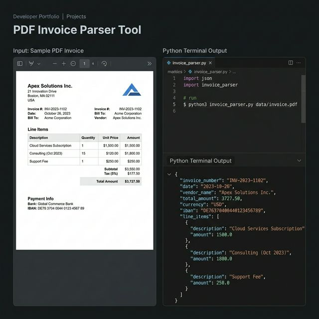

# Automated Invoice Data Extraction

A fast, completely offline PDF parser that automatically extracts structured vendor data, line items, and totals from invoices into clean JSON.

✔ Eliminates hours of manual data entry for accounting and finance teams
✔ Protects sensitive financial data by processing everything 100% locally with zero API dependencies
✔ Scales instantly from processing a single file to thousands of invoices in bulk

## Use Cases
- **Accounting Automation:** Automatically parse incoming vendor invoices and sync them directly into your accounting software.
- **Expense Management:** Extract and verify line items from employee receipts and PDF bills instantly.
- **Data Migration:** Digitize thousands of historical PDF invoices into a structured database format.

## Project Structure

```
pdf-invoice-parser/
├── parser.py                   # Core parsing + validation logic
├── samples/generate_sample.py  # Builds a sample invoice PDF to try the parser
├── tests/                      # pytest suite (EN + TR invoices, real PDF round-trip)
├── requirements.txt
└── requirements-dev.txt
```

## Setup

```bash
pip install -r requirements.txt
```

## Usage

```bash
# Parse a single invoice
python parser.py invoice.pdf --pretty

# Parse all PDFs in a directory (add --recursive for sub-folders)
python parser.py ./invoices/ --pretty

# Save output as JSON or as a one-row-per-invoice CSV for Excel
python parser.py ./invoices/ --output result.json
python parser.py ./invoices/ --output result.csv

# US-style dates (MM/DD/YYYY) and fail the run if anything looks wrong
python parser.py ./invoices/ --month-first --strict

# Try it without your own PDFs
pip install -r requirements-dev.txt
python samples/generate_sample.py
python parser.py samples/sample_invoice.pdf --pretty
```

| Flag | Description |
|---|---|
| `--output FILE` | Write `.json` or `.csv` |
| `--recursive` | Include sub-directories |
| `--include-raw` | Add the extracted text to the JSON |
| `--month-first` | Read ambiguous dates as MM/DD (default is DD/MM) |
| `--strict` | Exit code `2` if any invoice has validation warnings |

Exit codes: `0` ok · `1` a file could not be parsed · `2` warnings with `--strict`.

## What gets extracted

| Field | Notes |
|---|---|
| `vendor_name` | "From/Seller/Satıcı" labels, company suffixes (Ltd, Inc, GmbH, A.Ş.…), first line fallback |
| `invoice_number` | Invoice No / # / Fatura No / Rechnungsnummer |
| `invoice_date`, `due_date` | Normalised to ISO `YYYY-MM-DD` (numeric, `May 3, 2024`, `15 Mart 2024`) |
| `subtotal`, `tax_amount`, `total_amount` | Numbers, locale-independent (`1,234.56`, `1.234,56 TL`, `GBP 1,400.00`) |
| `currency` | ISO code from codes or symbols |
| `iban`, `iban_valid` | Spaces removed, mod-97 checksum verified |
| `line_items` | From ruled PDF tables first, then from column-aligned text |
| `warnings` | Validation results (see below) |

Common pitfalls of regex parsers are handled explicitly: *Subtotal* is never taken as the total,
*Tax ID / VAT No / Vergi Dairesi* lines are never taken as the tax amount, and item rows stop at the totals block.

## Validation

Every invoice is cross-checked and problems are reported in `warnings` instead of silently returning wrong data:

- subtotal + tax = total
- sum of line items = subtotal
- quantity × unit price = line total
- IBAN checksum
- due date not before invoice date
- missing total / scanned PDF without a text layer (needs OCR)

## Example Output

```json
[
  {
    "source_file": "sample_invoice.pdf",
    "vendor_name": "Acme Digital Ltd",
    "invoice_number": "INV-2024-001",
    "invoice_date": "2024-05-01",
    "due_date": "2024-05-31",
    "currency": "GBP",
    "subtotal": 1400.0,
    "tax_amount": 280.0,
    "total_amount": 1680.0,
    "iban": "GB29NWBK60161331926819",
    "iban_valid": true,
    "line_items": [
      {"description": "Web Development Service", "quantity": 1.0, "unit_price": 1200.0, "total": 1200.0},
      {"description": "Hosting (12 months)", "quantity": 12.0, "unit_price": 15.0, "total": 180.0},
      {"description": "SSL Certificate", "quantity": 1.0, "unit_price": 20.0, "total": 20.0}
    ],
    "warnings": []
  }
]
```

## Extending

Labels live in the `LABELS` dict in `parser.py` — add your own wording (any language) to the matching field.
`InvoiceParser.parse_text()` accepts plain text, so OCR output can be fed in directly.

## Tests

```bash
pip install -r requirements-dev.txt
pytest -q
```

## Tech Stack

`pdfplumber` · `fpdf2` (samples/tests)

## Screenshot



